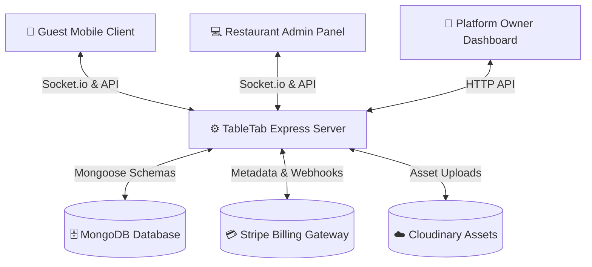

# TableTab 🍽️ — Premium Multi-Tenant SaaS Table-Side Ordering Platform

[](https://github.com)
[](https://react.dev/)
[](https://nodejs.org/)
[](https://www.mongodb.com/)
[](https://socket.io/)
[](https://stripe.com/)
[](https://vite-pwa-org.netlify.app/)

TableTab is a premium **Multi-Tenant Software as a Service (SaaS)** table-side dining, ordering, and venue management solution designed for modern restaurants and cafes. It provides a full, seamless pipeline from scanning table QR codes, viewing interactive and high-fidelity menus, submitting instant orders with Riyadh (Saudi Riyal) localizations, paying via Stripe, and routing tickets in real-time to active kitchen screens.

---

## 🏛️ System Architecture

TableTab is structured as a monorepo containing multiple decoupled components:

```
TableTab/
├── admin/       # Restaurant Operations & Control Panel (Owners, Chefs, Cashiers)
│   ├── src/pages/     # Menu Builder, Orders, Staff management, Profile, Subscription plans
│   └── src/components # Reusable layout components (e.g. dynamic SubscriptionAlert banner)
├── client/      # Guest App (Glassmorphic menus, cart, local guest order history, Stripe checkouts)
├── appowner/    # SaaS Platform Owner Dashboard (Global Tenant & Owner Account Management)
├── server/      # Monolithic Express API (MongoDB, Socket.io live updates, Stripe Billing Engine)
│   ├── models/        # Schemas (Tenant, Subscription, Menu, Order, AdminOTP, etc.)
│   ├── middlewares/   # Tenant-scoping validation, Auth, Subscription checks
│   └── controllers/   # Payment hooks, Order pipelines, QR printers, Staff onboarders
└── shared/      # Common assets, shared document helpers, and template utilities
```

Here is a visual map showing how customers, staff, and SaaS administrators interface with the centralized TableTab Server:



---

## ✨ Primary SaaS Capabilities

### 1. Robust Multi-Tenant Isolation
* **Middleware Scoping:** Every incoming request to functional endpoints (menus, categories, tables, orders) is validated through `tenantMiddleware.js` using custom request headers: `X-Tenant-Id` or `X-Tenant-Slug`.
* **Database Isolation:** Collections are query-filtered via the unique `tenantId` field to guarantee that restaurants never see each other's configuration, orders, or credentials.
* **Email Flexibility:** Staff and owner accounts are unique *per tenant* (`{ email, tenantId }`), enabling standard logins to operate correctly across multiple tenant scopes.

### 2. Premium Customer Ordering Client
* **Saudi Riyal (SAR) Localization:** All menus, subtotals, VAT calculations, and Stripe transactions are fully configured for Saudi Riyal formatting.
* **Secured Guest Ordering Session:** Solves multi-device leakage issues. Guest tokens are created dynamically for each client browser. When fetching history, empty or null tokens are automatically filtered to block unauthorized guests from viewing other customers' order histories.
* **Glassmorphic UI Design:** Interactive categories, smooth item increments, localized feedback states, and full-screen Stripe integration.

### 3. Kitchen & Ticket Dispatch (Real-time WebSockets)
* **Live Syncing:** Real-time bi-directional order dispatching using custom Socket.io rooms bounded by `tenantId`.
* **State Updates:** Instantly updates cashier and kitchen ticket status boards when orders are accepted, prepared, or marked as ready.
* **Sound Alerts:** Audio feedback alerts active kitchen staff when a table finishes their checkout.

### 4. Stripe-Powered SaaS Subscription Lifecycle
* **Authentication Grace Flow:** Expired tenants are not locked out of their accounts. The platform allows Owners to login via OTP and fetch their basic profile configurations even during expiration, keeping the "Subscription Plan Checkout" accessible.
* **Stackable Subscriptions:** Extending plans adds 30 days dynamically onto the current expiration timestamp (`expiresAt`), supporting stackable subscriptions.
* **Auto-Activation:** On successful Stripe confirmation, database hooks automatically set the Tenant status to `active`, extend their subscription dates, and generate detailed record sheets in the `Subscription` collection.

---

## ⚙️ Environment Configurations

Create `.env` files in their respective folders before launching the services:

### 1. Backend Server Configuration (`/server/.env`)
```env
PORT=5000
MONGO_URL=mongodb+srv://<username>:<password>@cluster.mongodb.net/tabletab
SECTRATE_KEY=your_jwt_signing_token_secret
STRIPE_SECRET_KEY=sk_test_51...
CLOUDINARY_URL=cloudinary://<api_key>:<api_secret>@cloud_name
EMAIL_USER=your_smtp_email@gmail.com
EMAIL_PASS=your_gmail_app_password_code
PLATFORM_OWNER_EMAIL=admin@tabletab.com
PLATFORM_OWNER_PASSWORD=secure_platform_password
```

### 2. Restaurant Admin Panel (`/admin/.env`)
```env
VITE_API_URL=http://localhost:5000
VITE_STRIPE_PUBLISHABLE_KEY=pk_test_51...
```

### 3. Customer Client Web App (`/client/.env`)
```env
VITE_API_URL=http://localhost:5000
VITE_STRIPE_PUBLISHABLE_KEY=pk_test_51...
```

---

## 🚀 Local Installation & Running

Make sure you have Node.js (v18+) and MongoDB installed locally.

### Step 1: Fire up the Backend Server
```bash
cd server
npm install
npm run server # Starts nodemon hot-reloading on port 5000
```

### Step 2: Spin up the Restaurant Admin Panel
```bash
cd admin
npm install
npm run dev # Launches local admin server on http://localhost:5173
```

### Step 3: Spin up the Customer Client Web App
```bash
cd client
npm install
npm run dev # Launches customer Ordering Client on http://localhost:5172
```

### Step 4: Spin up the SaaS Superadmin Console
```bash
cd appowner
npm install
npm run dev # Launches Superadmin Console on http://localhost:5174
```

---

## 🔒 Access Control & Permissions Matrix

TableTab enforces granular Role-Based Access Control (RBAC) on both API and client-side interfaces.

| Feature / Actions | Platform Superadmin | Venue Owner | Manager | Chef / Barista | Cashier | Dining Guest |
| :--- | :---: | :---: | :---: | :---: | :---: | :---: |
| **Manage SaaS Tenancy & Global Billings** | ✅ | ❌ | ❌ | ❌ | ❌ | ❌ |
| **Renew / Upgrade Subscription Plans** | ❌ | ✅ | ❌ | ❌ | ❌ | ❌ |
| **See Subscription Expiration Alert Banner** | ❌ | ✅ | ❌ | ❌ | ❌ | ❌ |
| **Manage Menu Items & Categories** | ❌ | ✅ | ✅ | ❌ | ❌ | ❌ |
| **Onboard Restaurant Staff Accounts** | ❌ | ✅ | ✅ | ❌ | ❌ | ❌ |
| **Manage Kitchen Orders & Ticket Queues** | ❌ | ✅ | ✅ | ✅ | ✅ | ❌ |
| **Generate Dining QR Codes & Barcode PDF**| ❌ | ✅ | ✅ | ❌ | ❌ | ❌ |
| **View Revenue & Financial Summaries** | ❌ | ✅ | ❌ | ❌ | ❌ | ❌ |
| **Place Table Orders & Pay Checkout** | ❌ | ❌ | ❌ | ❌ | ❌ | ✅ |

---

## ⚡ WebSocket Event Protocol

Real-time communication is established immediately upon client connection. Socket rooms are partitioned dynamically by the `tenantId`.

| Event Name | Sender | Payload | Description |
| :--- | :--- | :--- | :--- |
| `joinRoom` | Admin / Client | `{ tenantId }` | Registers socket connection to a specific tenant room. |
| `newOrder` | Client | `{ orderId, items, tableNumber }` | Broadcasts new order tickets to the restaurant's active kitchen dashboards. |
| `statusUpdate` | Admin | `{ orderId, status }` | Broadcasts status updates (e.g. `preparing`, `ready`) back to the client screen. |

---

## 💾 Core Database Models Description

* **Tenant:** Holds subscription metadata (`subscriptionPlan`, `status`, `expiresAt`, `trialUsed`), slug mappings, and configuration.
* **Subscription:** Log sheet records documenting previous card checkout transactions, payment dates, amounts, and plan structures.
* **AdminModel:** Users belonging to the admin site holding fields for `role` (`owner`, `manager`, `chef`, `cashier`, `barista`), matching `tenantId`, and metadata.
* **Menu & Category:** Represents items and hierarchal categories, including price details, tags, comments, and image links.
* **Order:** Holds details on ordered items, subtotal, TAX/VAT, table numbers, guest ordering tokens, payment status, and order status tracking.
* **AdminOTP:** Houses short-lived verification codes for owner and staff logins.

---

## 🛠️ Verification & Testing Playbook

### 💳 Testing Stripe Checkout & Renewal Flow
1. Log into the `/admin` site using your **Owner** credentials.
2. If your subscription is expired, the system will display a red warning banner: **"Your subscription has expired..."**.
3. Navigate to **Profile** or click **Renew Subscription** from the alert banner.
4. Select standard or premium options, input Stripe's mockup credit card credentials (`4242 4242 4242 4242`), and proceed.
5. Once complete, you will be redirected back, the banner will automatically clear, and the tenant status is set to `active`.

### 📱 Testing Real-Time Kitchen Sync
1. Open the `/client` portal on your smartphone or side-browser utilizing a generated Table QR code.
2. Open the `/admin` order dashboard on another window.
3. Place an order on the client page.
4. Verify that the admin dashboard instantly triggers an audio notification and displays the new order ticket without needing a manual refresh.
